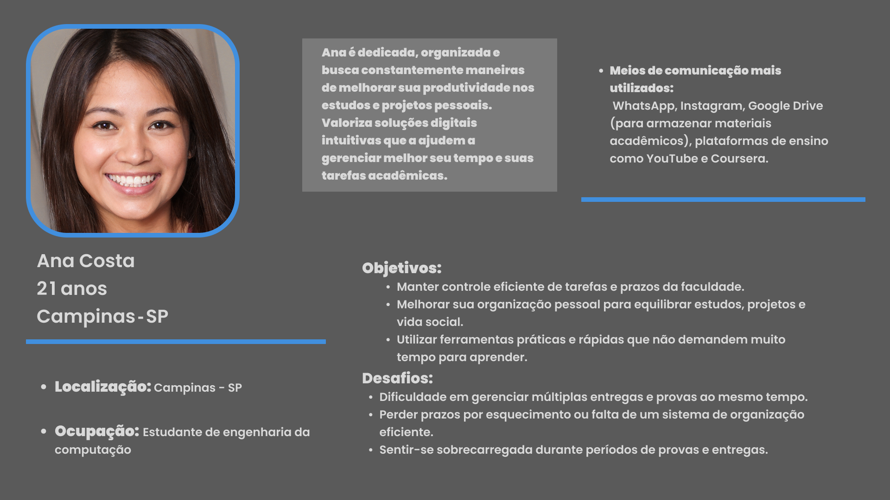
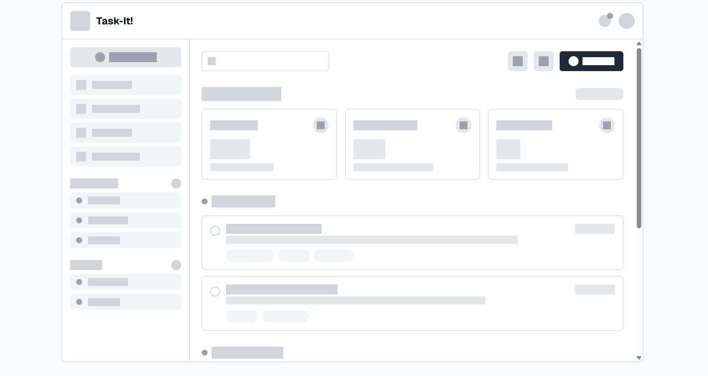
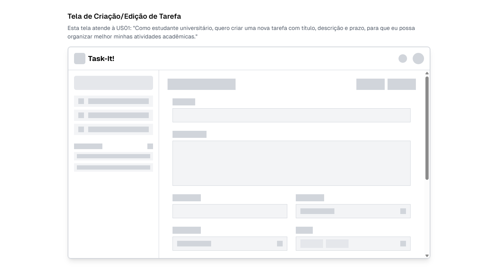
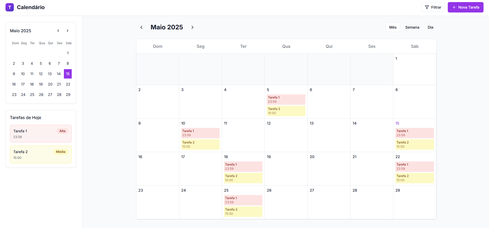

# Web Application Document - Projeto Individual - Módulo 2 - Inteli

**_Os trechos em itálico servem apenas como guia para o preenchimento da seção. Por esse motivo, não devem fazer parte da documentação final._**

## Task-It!


#### PIETRO ALKMIN 

## Sumário

1. [Introdução](#c1)  
2. [Visão Geral da Aplicação Web](#c2)  
3. [Projeto Técnico da Aplicação Web](#c3)  
4. [Desenvolvimento da Aplicação Web](#c4)  
5. [Referências](#c5)  

<br>

## <a name="c1"></a>1. Introdução (Semana 01)

O projeto será o desenvolvimento de um Gerenciador de Tarefas, ele será voltado para estudantes e profissionais que buscam organizar suas atividades diárias de forma simples e eficiente. O sistema permitirá a criação de tarefas, definição de prazos e organização por prioridade. O objetivo é facilitar o gerenciamento de rotinas e aumentar a produtividade dos usuários.

---

## <a name="c2"></a>2. Visão Geral da Aplicação Web

### 2.1. Personas (Semana 01)

<div align="center">
  <sub>FIGURA 1 - Persona </sub><br>
  <br>
  <sup>Fonte: Material produzido pelo autor, 2025</sup>
</div>

### 2.2. User Stories (Semana 01)

**Principais users storys:**

US01

Como estudante universitário, quero criar uma nova tarefa com título, descrição e prazo, para que eu possa organizar melhor minhas atividades acadêmicas.

US02

Como estudante universitário, quero visualizar minhas tarefas ordenadas por prioridade, para que eu saiba quais atividades devo realizar primeiro.

US03

Como estudante universitário, quero receber notificações antes do vencimento das tarefas, para que eu não perca prazos importantes.

**Análise INVEST da US01:**

Como estudante universitário, quero criar uma nova tarefa com título, descrição e prazo, para que eu possa organizar melhor minhas atividades acadêmicas.


**Justificativa:**

**I – Independente -**	A criação de tarefas é independente de outras funcionalidades, como listagem ou edição.

**N – Negociável -** A forma de criação pode ser discutida: com campos obrigatórios, opcionais, ou até inserção rápida.

**V – Valiosa -**	É fundamental para o funcionamento do sistema, pois sem tarefas não há o que organizar.

**E – Estimável	-** O esforço para implementar a criação de tarefas pode ser estimado facilmente pela equipe.

**S – Pequena -** A ação de criar uma tarefa é pequena e específica, focando em poucos campos (título, descrição e prazo).

**T – Testável	-** Pode ser testada criando uma nova tarefa e verificando se ela foi armazenada corretamente no sistema.


---

## <a name="c3"></a>3. Projeto da Aplicação Web

### 3.1. Modelagem do banco de dados  (Semana 3)

O banco de dados do sistema **Task-It!** foi projetado para suportar a organização e visualização de tarefas em um ambiente acadêmico, com foco em produtividade, categorização, agendamento e rastreamento de ações do usuário.

#### 🔗 Modelo Relacional

A imagem a seguir representa o modelo relacional do sistema, com todas as entidades principais e seus relacionamentos:


As principais entidades são:
- **users**: armazena os dados dos usuários do sistema.
- **tasks**: representa as tarefas criadas pelos usuários.
- **categories**: categorias atribuídas às tarefas (ex: estudos, trabalho).
- **tags**: etiquetas personalizadas para classificar tarefas.
- **checklists**: itens de checklist relacionados a cada tarefa.
- **anotacoes**: anotações adicionais que podem ser feitas dentro de uma tarefa.
- **log_atividades**: registra ações realizadas nas tarefas (criação, edição, conclusão).
- **tarefa_tags**: tabela associativa para o relacionamento N:N entre tarefas e tags.

#### Modelo Físico (SQL)

```sql
CREATE TABLE users (
  id SERIAL PRIMARY KEY,
  nome VARCHAR(100) NOT NULL,
  email VARCHAR(100) UNIQUE NOT NULL,
  senha VARCHAR(255) NOT NULL,
  criado_em TIMESTAMP DEFAULT CURRENT_TIMESTAMP
);

CREATE TABLE categories (
  id SERIAL PRIMARY KEY,
  nome VARCHAR(100) NOT NULL,
  user_id INT NOT NULL,
  FOREIGN KEY (user_id) REFERENCES users(id)
);

CREATE TABLE tasks (
  id SERIAL PRIMARY KEY,
  titulo VARCHAR(100) NOT NULL,
  descricao TEXT,
  vencimento DATE,
  prioridade VARCHAR(20),
  status VARCHAR(20) DEFAULT 'pendente',
  recorrente VARCHAR(20),
  data_hora_inicio DATETIME,
  data_hora_fim DATETIME,
  lembrete_minutos INT,
  user_id INT NOT NULL,
  categoria_id INT,
  FOREIGN KEY (user_id) REFERENCES users(id),
  FOREIGN KEY (categoria_id) REFERENCES categories(id)
);

CREATE TABLE checklists (
  id SERIAL PRIMARY KEY,
  conteudo VARCHAR(255) NOT NULL,
  concluido BOOLEAN DEFAULT FALSE,
  tarefa_id INT NOT NULL,
  FOREIGN KEY (tarefa_id) REFERENCES tasks(id)
);

CREATE TABLE tags (
  id SERIAL PRIMARY KEY,
  nome VARCHAR(50) NOT NULL,
  user_id INT NOT NULL,
  FOREIGN KEY (user_id) REFERENCES users(id)
);

CREATE TABLE tarefa_tags (
  tarefa_id INT NOT NULL,
  tag_id INT NOT NULL,
  PRIMARY KEY (tarefa_id, tag_id),
  FOREIGN KEY (tarefa_id) REFERENCES tasks(id),
  FOREIGN KEY (tag_id) REFERENCES tags(id)
);

CREATE TABLE anotacoes (
  id SERIAL PRIMARY KEY,
  conteudo TEXT NOT NULL,
  data TIMESTAMP DEFAULT CURRENT_TIMESTAMP,
  tarefa_id INT NOT NULL,
  FOREIGN KEY (tarefa_id) REFERENCES tasks(id)
);

CREATE TABLE log_atividades (
  id SERIAL PRIMARY KEY,
  tipo VARCHAR(50),
  data TIMESTAMP DEFAULT CURRENT_TIMESTAMP,
  tarefa_id INT NOT NULL,
  user_id INT NOT NULL,
  FOREIGN KEY (tarefa_id) REFERENCES tasks(id),
  FOREIGN KEY (user_id) REFERENCES users(id)
);
```
### 3.1.1 BD e Models (Semana 5)

O sistema Task-It! implementa um conjunto de Models que representam as entidades do banco de dados e encapsulam a lógica de negócios. O principal Model implementado é:

#### Task Model
O Model `Task` (localizado em `models/Task.js`) é responsável por gerenciar todas as operações relacionadas às tarefas no sistema. Ele implementa os seguintes métodos:

- `getAll()`: Retorna todas as tarefas ordenadas por data de criação
- `getById(id, userId)`: Busca uma tarefa específica pelo ID e usuário
- `create(taskData, userId)`: Cria uma nova tarefa no banco de dados
- `update(id, taskData, userId)`: Atualiza uma tarefa existente
- `delete(id, userId)`: Remove uma tarefa do banco de dados

O Model utiliza o pool de conexões do PostgreSQL configurado em `config/db.js` para realizar as operações no banco de dados de forma eficiente e segura.

### 3.2. Arquitetura (Semana 5)

A aplicação Task-It! segue a arquitetura MVC. O diagrama da arquitetura pode ser visualizado no [Mermaid Live Editor]
https://bit.ly/3SlqL2I


#### Componentes da Arquitetura

1. **Model (Camada de Dados)**
   - Implementado em `models/Task.js`
   - Gerencia a lógica de negócios e operações no banco
   - Utiliza pool de conexões PostgreSQL
   - Implementa métodos CRUD para tarefas

2. **View (Camada de Apresentação)**
   - Templates EJS em `views/pages` e `views/components`
   - Renderiza a interface do usuário
   - Implementa interatividade com JavaScript
   - Exibe dados dinâmicos das tarefas

3. **Controller (Camada de Controle)**
   - Implementado em `controllers/taskController.js`
   - Gerencia o fluxo de dados
   - Processa requisições HTTP
   - Coordena Model e View

#### Fluxo de Dados

1. O usuário interage com a interface no navegador
2. O Router direciona a requisição para o Controller apropriado
3. O Controller processa a requisição e aciona o Model
4. O Model executa operações no banco PostgreSQL
5. O Controller recebe os dados do Model
6. A View é atualizada com os novos dados
7. O resultado é enviado de volta ao navegador

Esta arquitetura permite uma clara separação de responsabilidades, facilitando a manutenção e escalabilidade do sistema.

### 3.3. Wireframes (Semana 03)

<div align="center">
  <sub>FIGURA 2 - Tela Principal </sub><br>
  <br>
  <sup>Fonte: Material produzido pelo autor, 2025</sup>
</div>

**Aqui uma breve descrição da tela principal:**

A tela principal do Task-It! é um dashboard funcional que exibe:

- **Cabeçalho** com logo, notificações e perfil do usuário
- **Menu lateral** com navegação, categorias e tags
- **Barra de busca** e botão para adicionar novas tarefas
- **Visão geral** com cards de estatísticas rápidas
- **Tarefas organizadas por prioridade** (alta, média, baixa)


Cada tarefa mostra título, descrição breve, prazo, categoria e tags relevantes. 
O design prioriza a visualização clara das tarefas mais importantes, permitindo 
que estudantes e profissionais identifiquem rapidamente o que precisa ser feito primeiro.

<div align="center">
  <sub>FIGURA 3 - Criação/Edição de tarefas </sub><br>
  <br>
  <sup>Fonte: Material produzido pelo autor, 2025</sup>
</div>

 **Tela de Criação/Edição de Tarefas - US01**

A tela de criação de tarefas atende à US01 através de:

- Campo para título da tarefa
- Área para descrição detalhada
- Seletor de data/hora para o prazo
- Opções complementares: prioridade, categoria, tags e checklist
- Botões de "Cancelar" e "Criar Tarefa"


Esta interface permite que estudantes organizem suas atividades acadêmicas de forma rápida e estruturada, com todos os campos necessários para um gerenciamento eficiente.

### 3.4. Guia de estilos (Semana 05)

*Descreva aqui orientações gerais para o leitor sobre como utilizar os componentes do guia de estilos de sua solução.*


### 3.5. Protótipo de alta fidelidade (Semana 05)

O protótipo de alta fidelidade do Task-It! foi desenvolvido para demonstrar a experiência final do usuário, com atenção especial aos detalhes visuais e interações.

<div align="center">
  <sub>FIGURA 4 - Dashboard em Alta Fidelidade</sub><br>
  <br>
  <sup>Fonte: Material produzido pelo autor, 2025</sup>
</div>

O dashboard em alta fidelidade apresenta uma interface moderna e limpa, com cards bem definidos para as tarefas, estatísticas claras e um sistema de navegação intuitivo.

<div align="center">
  <sub>FIGURA 5 - Tela de Calendário</sub><br>
  <br>
  <sup>Fonte: Material produzido pelo autor, 2025</sup>
</div>

A visualização em calendário permite aos usuários ter uma visão temporal clara de suas tarefas, com indicadores visuais de prioridade e status.

<div align="center">  <sub>FIGURA 6 - Tela de Criação de Tarefas em Alta Fidelidade</sub><br>
  <br>
  <sup>Fonte: Material produzido pelo autor, 2025</sup>
</div>

A tela de criação de tarefas em alta fidelidade apresenta um formulário intuitivo com todos os campos necessários: título, descrição, data/hora, prioridade, categoria, tags e checklist. O design limpo e organizado torna o processo de criação de tarefas simples e eficiente, atendendo diretamente à US01.

### 3.6. WebAPI e endpoints (Semana 05)

*Utilize um link para outra página de documentação contendo a descrição completa de cada endpoint. Ou descreva aqui cada endpoint criado para seu sistema.*  

### 3.7 Interface e Navegação (Semana 07)

*Descreva e ilustre aqui o desenvolvimento do frontend do sistema web, explicando brevemente o que foi entregue em termos de código e sistema. Utilize prints de tela para ilustrar.*

---

## <a name="c4"></a>4. Desenvolvimento da Aplicação Web (Semana 8)

### 4.1 Demonstração do Sistema Web (Semana 8)

*VIDEO: Insira o link do vídeo demonstrativo nesta seção*
*Descreva e ilustre aqui o desenvolvimento do sistema web completo, explicando brevemente o que foi entregue em termos de código e sistema. Utilize prints de tela para ilustrar.*

### 4.2 Conclusões e Trabalhos Futuros (Semana 8)

*Indique pontos fortes e pontos a melhorar de maneira geral.*
*Relacione também quaisquer outras ideias que você tenha para melhorias futuras.*


## <a name="c5"></a>5. Referências

_Incluir as principais referências de seu projeto, para que seu parceiro possa consultar caso ele se interessar em aprofundar. Um exemplo de referência de livro e de site:_<br>

---
---
