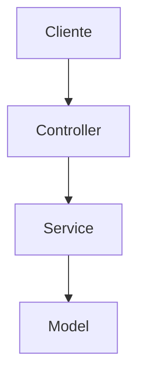

# Resumo de computação

# Semana 01 – Fundamentos de Computação

### 🧭 1. O que é um Browser?

### ✔️ Conceito:

Um **browser (navegador)** é um software que interpreta e renderiza páginas web escritas em HTML, CSS e JavaScript. Exemplos: Google Chrome, Firefox, Safari.

### 🔄 Funcionamento passo a passo:

1. **Você digita uma URL** como `https://google.com`.
2. O navegador **quebra a URL** e faz uma **requisição HTTP** para o servidor.
3. O **servidor responde** com arquivos HTML, CSS, JS.
4. O navegador **interpreta o HTML** criando a **árvore DOM (Document Object Model)**.
5. Aplica o CSS para formar a **Render Tree**.
6. O JavaScript é executado, podendo manipular o DOM dinamicamente.
7. O resultado final é **renderizado** na sua tela.

### 📊 Chrome DevTools (Ferramenta de Desenvolvimento):

- Aba **Network**: mostra requisições HTTP, tempo de carregamento, etc.
- Aba **Elements**: mostra o DOM renderizado.
- Aba **Console**: permite testar comandos JS e ver erros.

### 🌐 HTTP vs HTTPS:

- **HTTP**: protocolo de transferência de dados sem criptografia.
- **HTTPS**: versão segura com criptografia SSL/TLS.

---

### 🖥 2. Arquitetura Cliente-Servidor e Protocolos

### ✔️ Conceito:

- A **Web** funciona no modelo **cliente-servidor**.
- O **cliente** (browser) faz uma requisição.
- O **servidor** (web ou de aplicação) responde com os dados/páginas.

### 🧠 Protocolos principais:

| Protocolo | Finalidade |
| --- | --- |
| HTTP/HTTPS | Comunicação cliente-servidor |
| TCP | Confiável e ordenado (web, email) |
| UDP | Rápido, mas sem garantia (vídeo) |

---

### ⚙️ 3. Setup com Node.js, VSCode e Supabase

### ✅ Node.js

- **Ambiente de execução** para JavaScript fora do browser.
- Usado para **APIs, servidores web**, automações, etc.

### ✅ VSCode

- Editor de código com **extensões, terminal integrado e depurador**.
- Altamente usado por devs JS.

### ✅ Supabase

- Backend open-source baseado em **PostgreSQL**.
- Inclui: banco de dados, autenticação, storage, tempo real.

### 🚀 Recursos úteis no Supabase:

- **Console visual**
- **SQL direto**
- **Auth (login, signup)**
- **Reatividade em tempo real**
- **Plano gratuito**

---

### 🏗 4. Introdução ao MVC (Model-View-Controller)

### ✔️ Conceito:

O padrão **MVC** separa responsabilidades em 3 camadas:

| Camada | Responsabilidade |
| --- | --- |
| **Model** | Lida com dados e lógica de negócios |
| **View** | Interface e visualização para o usuário |
| **Controller** | Media as ações entre Model e View |

### 🧠 Exemplo prático:

```jsx
// Model
const users = [{ id: 1, name: "Átila" }];

// Controller
function getUserById(id) {
  return users.find(user => user.id === id);
}

// View (simulada com console)
console.log("Usuário:", getUserById(1));

```

---

### 🪜 5. Anatomia de uma Aplicação em Camadas

### ✔️ Conceito:

- Arquitetura que **divide o sistema em camadas** (Presentation, Business, Data).
- Ajuda a organizar, escalar e manter o sistema.

### 🧱 Exemplo:

```
[Camada de Apresentação] -> React/Vue
[Camada de Negócio] -> Regras em Node.js
[Camada de Dados] -> Banco PostgreSQL

```

---

### 🛠 6. GitFlow (Fluxo de Git Profissional)

### ✔️ GitFlow Básico:

| Ramificação | Função |
| --- | --- |
| `main` | Versão de produção |
| `develop` | Versão de desenvolvimento |
| `feature/*` | Novas funcionalidades |
| `hotfix/*` | Correções urgentes |
| `release/*` | Preparação de versão |

### 💡 Exemplo:

```bash
git checkout -b feature/login
# faz mudanças...
git add .
git commit -m "add login page"
git push origin feature/login

```

---

### 🧩 7. SCRUM – Estratégias para Tasks

### 📋 Como escrever boas tasks:

1. Derivadas de uma **User Story**.
2. Clareza técnica: o que deve ser feito, por quem e em quanto tempo.
3. **Critérios de aceitação**: ajudam a saber se está “pronto”.

### 📌 Exemplo:

> Task: Criar botão de login
> 
> 
> Critérios:
> 
> - Botão aparece na tela de login
> - Dispara função ao clicar
> - Tem estilo visual conforme design

---

### 🧠 8. Paradigmas de Programação (Leitura opcional, mas útil)

| Paradigma | Característica-chave |
| --- | --- |
| Imperativo | Passos sequenciais, estilo “faça isso depois aquilo” |
| Funcional | Funções puras, sem estado |
| OO (Orientado a Objetos) | Objetos com estado e comportamento |

# Semana 02 – Fundamentos de Banco de Dados e SQL

---

### 🧠 1. O que é SQL?

### ✔️ SQL (Structured Query Language)

Linguagem usada para gerenciar dados em bancos de dados relacionais. Permite:

- **Consultar dados** (`SELECT`)
- **Inserir dados** (`INSERT`)
- **Atualizar dados** (`UPDATE`)
- **Remover dados** (`DELETE`)
- **Criar estruturas** (tabelas, views, etc.)

---

### 🔍 2. Principais Comandos SQL

### 🔹 SELECT (consulta)

```sql
SELECT nome, idade FROM usuarios;

```

### 🔹 DISTINCT (remove duplicados)

```sql
SELECT DISTINCT cidade FROM clientes;

```

### 🔹 WHERE (filtragem)

```sql
SELECT * FROM pedidos WHERE preco > 100;

```

### 🔹 LIMIT (limita quantidade)

```sql
SELECT * FROM produtos LIMIT 10;

```

### 🔹 ORDER BY (ordenar)

```sql
SELECT nome FROM usuarios ORDER BY idade DESC;

```

### 🔹 IN / BETWEEN / LIKE / NOT

```sql
SELECT * FROM vendas WHERE produto IN ('Café', 'Chá');
SELECT * FROM vendas WHERE preco BETWEEN 10 AND 50;
SELECT * FROM clientes WHERE nome LIKE 'A%';
SELECT * FROM pedidos WHERE NOT status = 'entregue';

```

### 🔹 Funções de agregação:

```sql
SELECT COUNT(*), MAX(preco), MIN(preco), SUM(preco) FROM pedidos;

```

### 🔹 GROUP BY + HAVING:

```sql
SELECT produto, SUM(quantidade)
FROM vendas
GROUP BY produto
HAVING SUM(quantidade) > 100;

```

### 🔹 CASE (condicional no SELECT):

```sql
SELECT nome,
       CASE
         WHEN idade >= 18 THEN 'Maior de idade'
         ELSE 'Menor de idade'
       END AS categoria
FROM usuarios;

```

---

### 🧱 3. Modelagem de Banco de Dados

### 📌 3 Níveis de Modelagem:

| Modelo | Características |
| --- | --- |
| **Conceitual** | Entidade-Relacionamento (ER), alto nível, sem SGBD |
| **Lógico** | Tabelas relacionais com chaves primárias/estrangeiras |
| **Físico** | Especificações reais em SQL (tipos, constraints, etc.) |

---

### 🖧 4. Bancos de Dados: SQL vs NoSQL

### 🔸 SQL (relacional)

- Estrutura fixa (tabelas com colunas e tipos definidos)
- Relacionamentos fortes
- Exemplo: PostgreSQL, MySQL

### 🔸 NoSQL (não-relacional)

- Estrutura flexível (documentos, grafos, colunas, chave-valor)
- Alta escalabilidade horizontal
- Exemplo: MongoDB (documentos), Neo4j (grafos)

---

### 🌐 5. Arquiteturas de Banco de Dados

### 🔹 On-Premise:

- Instalado localmente
- Custo de infraestrutura e manutenção sob controle do time

### 🔹 Cloud:

- Acesso remoto, escalabilidade automática
- Exemplo: Supabase (PostgreSQL gerenciado)

---

### 🛠 6. Conectando com DBeaver + Supabase

### ✅ DBeaver:

Ferramenta GUI open source para gerenciar bancos SQL.

### 🪜 Passos:

1. Criar banco no **Supabase**
2. Copiar os dados de conexão (host, user, senha, porta)
3. No DBeaver: criar nova conexão PostgreSQL
4. Inserir dados copiados do Supabase
5. Testar e salvar

---

### 🧮 7. Bancos Não-Relacionais (NoSQL)

### ✅ Tipos comuns:

| Tipo | Exemplo | Quando usar |
| --- | --- | --- |
| Documentos | MongoDB | Dados flexíveis, JSON-like |
| Grafos | Neo4j | Relações complexas entre nós |
| Colunar | Cassandra | Leituras em larga escala |
| Chave-valor | Redis | Cache, dados simples |

### 📌 Banco de grafos:

- Usado para representar conexões complexas.
- Ex: redes sociais, rotas logísticas.

# Semana 03 – SQL: Fundamentos e Operações CRUD com PostgreSQL

---

### 📚 1. Fundamentos da Linguagem SQL

### ✅ O que é SQL?

- SQL = *Structured Query Language*
- Linguagem declarativa padrão para manipular bancos **relacionais** (como PostgreSQL).
- Utilizada para **definir estruturas**, **inserir, ler, atualizar e apagar dados**.

### 🧠 Conceitos importantes:

| Comando | Finalidade |
| --- | --- |
| `CREATE` | Criar estruturas (tabelas, etc.) |
| `SELECT` | Consultar dados |
| `INSERT` | Inserir dados |
| `UPDATE` | Atualizar dados |
| `DELETE` | Excluir dados |
| `DROP` | Deletar estruturas |
| `ALTER` | Alterar estrutura de tabelas |

---

### 🔧 2. CRUD no PostgreSQL

> CRUD = Create, Read, Update, Delete
> 

### 🟩 **CREATE – Inserindo dados**

```sql
INSERT INTO usuarios (nome, idade)
VALUES ('Átila', 21);

```

### 🟦 **READ – Lendo dados**

```sql
SELECT * FROM usuarios;
SELECT nome FROM usuarios WHERE idade > 18;

```

### 🟨 **UPDATE – Atualizando dados**

```sql
UPDATE usuarios
SET idade = 22
WHERE nome = 'Átila';

```

### 🟥 **DELETE – Removendo dados**

```sql
DELETE FROM usuarios WHERE nome = 'Átila';

```

---

### 🧱 Exemplo prático completo

```sql
-- Criação de tabela
CREATE TABLE usuarios (
  id SERIAL PRIMARY KEY,
  nome TEXT,
  idade INT
);

-- Inserir dados
INSERT INTO usuarios (nome, idade) VALUES
('Ana', 30),
('Carlos', 25),
('João', 40);

-- Consultar dados
SELECT * FROM usuarios;

-- Atualizar um registro
UPDATE usuarios SET idade = 35 WHERE nome = 'Carlos';

-- Deletar um registro
DELETE FROM usuarios WHERE nome = 'João';

```

---

### 🗄 PostgreSQL: Características

- **SGBD relacional robusto e open-source**
- Suporte a:
    - Chaves primárias e estrangeiras
    - Procedimentos armazenados
    - JSON e dados semi-estruturados
    - Operações complexas com alto desempenho

---

Com esse conteúdo, você já cobre:

- Conceitos teóricos de SQL
- Aplicação prática com comandos de CRUD
- Uso direto com PostgreSQL, o banco que vocês utilizam via Supabase

# Semana 04 – Consultas SQL Avançadas + Node.js e API com JavaScript

---

### 📘 1. Consultas SQL – Parte II (Cap. 2, p. 101–117)

### Novos conceitos abordados:

- **Subconsultas (Subqueries)**
- **Consultas com múltiplas tabelas (JOINs)**
- **Funções de string e datas**
- **Operadores de conjunto: `UNION`, `INTERSECT`, `EXCEPT`**

### 🧪 Exemplos:

**Subquery (subconsulta no `WHERE`):**

```sql
SELECT nome FROM clientes
WHERE id IN (
  SELECT cliente_id FROM pedidos WHERE valor > 1000
);

```

**Subquery (em `SELECT`):**

```sql
SELECT nome,
       (SELECT COUNT(*) FROM pedidos WHERE pedidos.cliente_id = clientes.id) AS total_pedidos
FROM clientes;

```

---

### 🔗 2. Trabalhando com Várias Tabelas

### ✅ Por que usar várias tabelas?

- Evita **redundância de dados**
- Garante **normalização**
- Melhora **consistência** e **performance**

### Exemplo ruim (tudo em uma tabela):

```sql
-- Nome do cliente, produto, valor, endereço, etc. em uma única tabela => difícil de manter

```

### Exemplo bom (dados separados):

- Tabela `clientes`
- Tabela `pedidos` com campo `cliente_id`

---

### 🔑 3. Chave Primária e Estrangeira

| Tipo de chave | Função |
| --- | --- |
| **Primária** | Identificador único da tabela |
| **Estrangeira** | Referência a chave primária de outra tabela |

### Exemplo:

```sql
CREATE TABLE clientes (
  id SERIAL PRIMARY KEY,
  nome TEXT
);

CREATE TABLE pedidos (
  id SERIAL PRIMARY KEY,
  cliente_id INT REFERENCES clientes(id),
  valor NUMERIC
);

```

---

### 🤝 4. JOINs (Junções entre tabelas)

### ✅ Tipos principais:

| Tipo | Explicação |
| --- | --- |
| `INNER JOIN` | Apenas registros que têm correspondência |
| `LEFT JOIN` | Todos da tabela da esquerda, mesmo sem correspondência |
| `RIGHT JOIN` | Todos da direita, mesmo sem correspondência |
| `FULL JOIN` | Todos de ambas, com ou sem correspondência |

### 🧪 Exemplo:

```sql
SELECT clientes.nome, pedidos.valor
FROM clientes
INNER JOIN pedidos ON clientes.id = pedidos.cliente_id;

```

---

### 📚 5. Tutorial SQL – Revisão Geral

Destaques:

- Operações de filtragem (`WHERE`, `IN`, `BETWEEN`)
- Ordenação (`ORDER BY`)
- Agrupamento e agregação (`GROUP BY`, `HAVING`, `COUNT`, `AVG`, etc.)
- Junções (`JOINs`)
- Subconsultas

🔗 [Tutorial DevMedia](https://www.devmedia.com.br/tutorial-sql/2973)

---

## ⚙️ 6. Node.js – Fundamentos

### 📌 O que é o Node.js?

- Ambiente para executar código **JavaScript fora do navegador**
- Usado para construir **servidores e APIs**
- Baseado no **motor V8 do Chrome**

### 🔧 NPM & package.json:

- **NPM**: gerenciador de pacotes (instala dependências)
- **package.json**: descreve o projeto e guarda os pacotes

### 🧪 Comandos úteis:

```bash
npm init -y           # cria package.json
npm install express   # instala o Express (framework de servidor)

```

---

## 🔗 7. Requisições com JavaScript: `fetch`

### 📤 PUT (atualização)

```jsx
fetch('https://api.exemplo.com/usuarios/1', {
  method: 'PUT',
  headers: {
    'Content-Type': 'application/json',
  },
  body: JSON.stringify({ nome: 'Átila Atualizado' })
});

```

### ❌ DELETE

```jsx
fetch('https://api.exemplo.com/usuarios/1', {
  method: 'DELETE'
});

```

### 🧪 Exemplo completo:

```jsx
// Atualiza usuário
async function atualizarUsuario() {
  const resposta = await fetch('/api/usuarios/1', {
    method: 'PUT',
    headers: { 'Content-Type': 'application/json' },
    body: JSON.stringify({ nome: 'Novo Nome' })
  });
  const dados = await resposta.json();
  console.log(dados);
}

```

---

## 🛠️ 8. Criação de API com Node.js

> Para quem está estudando para criar sistemas com backend real
> 

### Estrutura básica de um servidor com Express:

```jsx
const express = require('express');
const app = express();
app.use(express.json());

app.get('/usuarios', (req, res) => {
  res.json([{ id: 1, nome: "Átila" }]);
});

app.listen(3000, () => console.log('Servidor rodando!'));

```

---

Com isso, você tem:

- **SQL avançado com JOINs e Subqueries**
- **Fundamentos de banco relacional e modelagem**
- **Introdução a API com JavaScript e Node.js**

## Semana 05 – JSON, HTML e Arquitetura com Controllers, Models e Endpoints

---

### 📦 1. Entrada e Saída de Dados com JSON

### ✅ O que é JSON?

- **JSON (JavaScript Object Notation)** é um formato leve de **troca de dados**.
- É **baseado em texto** e **fácil de ler e escrever**, sendo amplamente usado em APIs.
- Suporta apenas:
    - Objetos `{ chave: valor }`
    - Arrays `[ valor1, valor2 ]`
    - Valores primitivos (string, número, booleano, null)

### 🔍 Exemplo de JSON:

```json
{
  "nome": "Átila",
  "idade": 21,
  "interesses": ["programação", "música"]
}

```

### 📤 Enviando JSON (ex: com fetch):

```jsx
fetch('/api/usuarios', {
  method: 'POST',
  headers: { 'Content-Type': 'application/json' },
  body: JSON.stringify({ nome: "Átila", idade: 21 })
});

```

### 📥 Recebendo JSON:

```jsx
fetch('/api/usuarios')
  .then(res => res.json())
  .then(data => console.log(data));

```

---

### 🌐 2. HTML Básico (Cap. 6, Seção 6.1 – Flanagan)

### ✅ O que é HTML?

- Linguagem de marcação para estruturar páginas web.
- Define **títulos, parágrafos, links, listas, formulários**, etc.

### 🧱 Estrutura básica:

```html
<!DOCTYPE html>
<html>
  <head>
    <title>Minha Página</title>
  </head>
  <body>
    <h1>Título</h1>
    <p>Parágrafo de exemplo.</p>
  </body>
</html>

```

### 📌 Tags comuns:

| Tag | Função |
| --- | --- |
| `<h1>` a `<h6>` | Títulos |
| `<p>` | Parágrafo |
| `<a href>` | Link |
| `<ul><li>` | Lista não ordenada |
| `<form>` | Formulário |
| `<input>` | Campo de entrada |
| `<button>` | Botão |

### 📍 Importante para a prova:

- Você pode **criar páginas simples** com formulários ou simulações de consumo de dados.
- HTML é usado como **"View"** em uma arquitetura web (junto com CSS e JS).

---

### 🛠️ 3. Criando Endpoints, Controllers e Models (Arquitetura MVC)

### ✅ Definições:

| Componente | Função |
| --- | --- |
| **Model** | Representa a estrutura dos dados (ex: usuários) |
| **Controller** | Lida com as regras e lógica (recebe requisições) |
| **Endpoint** | URL + método HTTP que aciona um controller |

---

### 🧪 Exemplo prático com Express (Node.js):

```jsx
// Model (simples)
const usuarios = [{ id: 1, nome: "Átila" }];

// Controller
function listarUsuarios(req, res) {
  res.json(usuarios);
}

// Endpoint
const express = require('express');
const app = express();
app.get('/api/usuarios', listarUsuarios);
app.listen(3000, () => console.log('Rodando na porta 3000'));

```

### 🗂 Estrutura comum de pastas:

```
project/
├── controllers/
│   └── usuarioController.js
├── models/
│   └── usuarioModel.js
├── routes/
│   └── usuarioRoutes.js
├── server.js

```

### 🔁 Ciclo de uma requisição:

1. **Cliente** faz uma requisição `GET /api/usuarios`
2. A **rota** identifica o endpoint e chama o **controller**
3. O **controller** interage com o **model**
4. A resposta é **enviada em JSON**

---

### 🧠 Conceito-chave para a prova:

> JSON é o formato padrão de comunicação entre frontend e backend. HTML monta a interface. Node.js cria as rotas e os controllers que manipulam o fluxo de dados. Isso tudo compõe uma aplicação web funcional e modular (padrão MVC).
> 

## Semana 06 – HTML, DOM, jQuery, EJS e Arquitetura Visual

---

### 🧱 1. HTML e suas Estruturas

### ✅ Elementos fundamentais de uma página HTML:

| Tag | Função |
| --- | --- |
| `<html>` | Estrutura do documento |
| `<head>` | Metadados, `<title>`, links de CSS |
| `<body>` | Conteúdo visível da página |
| `<h1>`–`<h6>` | Títulos |
| `<p>` | Parágrafos |
| `<a>` | Links |
| `` | Imagens |
| `<ul><li>` | Listas |
| `<form>`, `<input>`, `<button>` | Formulários e interações |

---

### 🎯 2. Boas Práticas de HTML Profissional

### ✅ Práticas recomendadas:

- Use **tags semânticas**: `<header>`, `<nav>`, `<section>`, `<article>`, `<footer>`
- Organize e **identifique com `id` e `class`**
- Sempre feche as tags corretamente
- **Melhore a acessibilidade** com `alt`, `label`, ARIA
- **SEO**: use `<meta>` tags e semântica para indexação

---

### 🌳 3. DOM (Document Object Model)

### ✅ O que é o DOM?

- Representação em árvore da estrutura HTML
- Cada tag vira um **objeto acessível pelo JavaScript**

### 🧪 Exemplo:

```html
<p id="mensagem">Olá!</p>
<script>
  const msg = document.getElementById("mensagem");
  msg.textContent = "Texto alterado via DOM!";
</script>

```

---

### ⚙️ 4. jQuery ("Jim Carrey") – DOM com menos esforço

### ✅ jQuery simplifica:

| DOM Vanilla JS | jQuery |
| --- | --- |
| `document.getElementById("id")` | `$("#id")` |
| `element.textContent` | `$("#id").text()` |
| `element.addEventListener()` | `$("#id").on("click", ...)` |

### 🧪 Exemplo:

```html
<script src="https://code.jquery.com/jquery-3.6.0.min.js"></script>
<script>
  $("#botao").on("click", () => {
    $("#msg").text("Alterado com jQuery!");
  });
</script>

```

---

### 🎨 5. Views com EJS

### ✅ O que é EJS?

- **Embedded JavaScript**: permite renderizar HTML com dados dinâmicos vindo do backend.
- Usado com **Express** no Node.js.

### 🗂 Estrutura comum:

```
views/
├── index.ejs
public/
├── style.css

```

### 🧪 Exemplo EJS:

```
<h1>Olá <%= nome %></h1>

```

### Express renderizando EJS:

```jsx
app.set('view engine', 'ejs');
app.get('/', (req, res) => {
  res.render('index', { nome: 'Átila' });
});

```

---

### 🧠 6. Arquitetura MVC + Service Layer

### ✅ Revisão do MVC:

| Camada | Função |
| --- | --- |
| **Model** | Dados e lógica de negócio |
| **View** | Interface visual |
| **Controller** | Lida com requisições/respostas |

### 🔧 Service Layer:

- Intermediária entre Controller e Model
- Reúsa lógicas como regras de negócio e validações
- Ajuda a manter **baixa acoplabilidade**

### 🧪 Exemplo:

```jsx
// controller
const userService = require('../services/userService');
exports.getUser = (req, res) => {
  const user = userService.findUser(req.params.id);
  res.json(user);
};

```

---

### 📊 7. Diagramas com Mermaid

### ✅ O que é Mermaid?

- Gera diagramas a partir de texto, tipo Markdown.
- Útil para **fluxogramas, arquitetura, Gantt charts**.

### 🧪 Exemplo Mermaid:

```markdown


```

🔗 Tutorial oficial: [Mermaid + Visual Diagrams](https://www.notion.so/Mermaid-e-Arquiteturas-Visuais-As-a-Code-1c3256ceaea780c09908f4c8893a9f09?pvs=21)

---

Com esse conteúdo, você cobre tudo que pode ser cobrado sobre:

- Estrutura de página (HTML)
- Manipulação dinâmica (DOM e jQuery)
- Geração de views dinâmicas com dados (EJS)
- Organização backend (MVC + Services)
- Representação visual de sistemas (Mermaid)

## Semana 07 – Fetch API, Requisições Assíncronas, CSS, Responsividade e jQuery

---

### 📤 1. Fetch API – Requisições HTTP com JavaScript

### ✅ O que é `fetch()`?

- Método moderno para **fazer requisições HTTP assíncronas**.
- Permite **conectar frontend com backend/APIs**.

### 🧪 Exemplo básico:

```jsx
fetch('/api/dados')
  .then(res => res.json())
  .then(data => console.log(data))
  .catch(err => console.error("Erro:", err));

```

### 📬 Requisição POST:

```jsx
fetch('/api/usuarios', {
  method: 'POST',
  headers: { 'Content-Type': 'application/json' },
  body: JSON.stringify({ nome: "Átila" })
});

```

---

### 🧠 2. Requisições assíncronas com Controllers

### ✅ Fluxo típico em Node.js + Express:

1. Usuário aciona evento no frontend
2. `fetch()` envia os dados para o backend
3. **Controller** recebe e processa
4. **Model** interage com o banco
5. Controller envia resposta em JSON

### 🧪 Exemplo de controller:

```jsx
exports.criarUsuario = async (req, res) => {
  const { nome } = req.body;
  const novo = await UsuarioModel.create({ nome });
  res.status(201).json(novo);
};

```

---

### 📡 3. Fundamentos de Redes (Protocolos)

### 🧱 Protocolos de rede:

- **HTTP/HTTPS**: comunicação cliente-servidor
- **TCP/IP**: garante envio confiável e roteamento
- **DNS**: resolve nomes como `google.com` em IPs

### 📬 Protocolo IP (Camada Internet):

- Encapsula dados em **datagramas**
- Usa **endereços IP únicos**
- Responsável por **endereçamento e roteamento**

---

### 📥 4. Formulários e Rotas (com Express + EJS)

### 🧪 Exemplo:

```html
<form method="POST" action="/login">
  <input name="usuario" />
  <input type="password" name="senha" />
  <button type="submit">Entrar</button>
</form>

```

```jsx
// rota
app.post('/login', controller.verificarLogin);

// controller
exports.verificarLogin = (req, res) => {
  const { usuario, senha } = req.body;
  // lógica de autenticação...
};

```

---

## 🎨 5. CSS – Parte 1 a 3

### ✅ Conceitos básicos:

| Conceito | Exemplo |
| --- | --- |
| Seletores | `p`, `.classe`, `#id` |
| Propriedades | `color`, `font-size`, `margin`, `padding` |
| Comentários | `/* isso é um comentário */` |

### 🧪 Sintaxe:

```css
h1 {
  color: blue;
  font-size: 24px;
}

```

### ✅ Como aplicar:

- Inline: `<p style="color: red;">`
- Interno: `<style>` dentro do HTML
- Externo: `<link rel="stylesheet" href="style.css">`

---

### 📱 6. Responsividade

### ✅ O que é:

Capacidade da página se adaptar a diferentes tamanhos de tela (mobile, tablet, desktop)

### 📌 Técnicas principais:

- **Unidades relativas**: `em`, `rem`, `%`
- **Media Queries**:

```css
@media (max-width: 768px) {
  body { font-size: 14px; }
}

```

- **Flexbox** e **Grid** para layout fluido

---

### 🧪 7. jQuery + CSS (classes, dimensões, propriedades)

### ✅ Exemplo de manipulação com jQuery:

```jsx
// Alterar classe
$("#btn").addClass("ativo");

// Alterar propriedade CSS
$("#caixa").css("background-color", "lightblue");

// Ver dimensões
let altura = $("#caixa").height();

```

📌 Link útil: [jQuery CSS Tutorial](https://www.tutorialspoint.com/jquery/jquery-css.htm)

---

### 🧰 8. Bootstrap (Framework CSS – opcional)

- Framework com **componentes prontos** e **responsividade embutida**
- Utiliza classes como:

```html
<div class="container">
  <button class="btn btn-primary">Clique aqui</button>
</div>

```

🔗 [Bootstrap 5 Docs](https://getbootstrap.com/docs/5.0/getting-started/introduction/)

---

Com isso, você finaliza **todo o ciclo de desenvolvimento frontend + backend com JavaScript**, cobrindo:

- Requisições assíncronas (`fetch`)
- Criação de APIs (`controllers`)
- HTML + CSS com responsividade
- Manipulação de DOM com jQuery
- Diagramas, rotas, formulários e arquitetura de rede

## Semana 08 – Qualidade de Software, Testes Automatizados, TDD e Jest

---

### 📈 1. Qualidade de Software (Cap. 15 – Pressman)

### ✅ Conceitos-chave:

- Qualidade de software é a **conformidade com requisitos funcionais e não funcionais**.
- Envolve:
    - **Confiabilidade**
    - **Manutenibilidade**
    - **Eficiência**
    - **Usabilidade**
    - **Portabilidade**
    - **Testabilidade**

### 🎯 Boas práticas incluem:

- Testes automatizados
- Revisões de código
- Métricas (ex: cobertura de testes, defeitos por linha)

---

### 🕵️ 2. Revisões de Software (Cap. 16)

### ✅ Tipos de revisões:

| Tipo | Descrição |
| --- | --- |
| **Inspeção** | Formal, focada em encontrar defeitos |
| **Revisão técnica** | Avaliação da lógica, arquitetura, requisitos |
| **Revisão de pares** | Informal, entre colegas de equipe |

### 📌 Objetivo:

Detectar **defeitos cedo**, antes de chegar aos testes ou à produção.

---

### 📋 3. Planejamento de Testes (Cap. 19)

### ✅ Elementos do plano de teste:

- **Objetivos do teste**
- **Critérios de entrada e saída**
- **Tipos de teste (unitário, integração, sistema, aceitação)**
- **Ambiente e ferramentas**
- **Cronograma**
- **Métricas (tempo de execução, cobertura, defeitos encontrados)**

---

### 📐 4. Testes AAA – Arrange, Act, Assert

### ✅ Padrão estruturado de testes unitários:

| Etapa | Descrição |
| --- | --- |
| **Arrange** | Configura o cenário de teste |
| **Act** | Executa a funcionalidade que será testada |
| **Assert** | Verifica se o resultado foi o esperado |

### 🧪 Exemplo com JavaScript:

```jsx
test("soma dois números", () => {
  // Arrange
  const a = 2, b = 3;

  // Act
  const resultado = somar(a, b);

  // Assert
  expect(resultado).toBe(5);
});

```

---

### ⚙️ 5. Testes com Jest

### ✅ O que é Jest?

- Framework de testes criado pelo Facebook
- Suporta **testes unitários**, **mocks**, **cobertura de código**, etc.

### 🧪 Instalação:

```bash
npm install --save-dev jest

```

### ✅ Comandos principais:

```json
// package.json
"scripts": {
  "test": "jest"
}

```

### 🧪 Exemplo simples:

```jsx
function somar(a, b) {
  return a + b;
}
module.exports = somar;

```

```jsx
const somar = require('./somar');

test("soma dois números", () => {
  expect(somar(1, 2)).toBe(3);
});

```

---

### 🔁 6. TDD – Test Driven Development

### ✅ Ciclo do TDD:

1. **Escreva um teste que falha** (test first)
2. **Implemente o código mínimo** para passar o teste
3. **Refatore o código**
4. **Repita**

### 🧠 Benefícios:

- Força o pensamento baseado em requisitos
- Reduz regressões
- Facilita refatoração

---

### 📌 Resumo Final da Semana 08