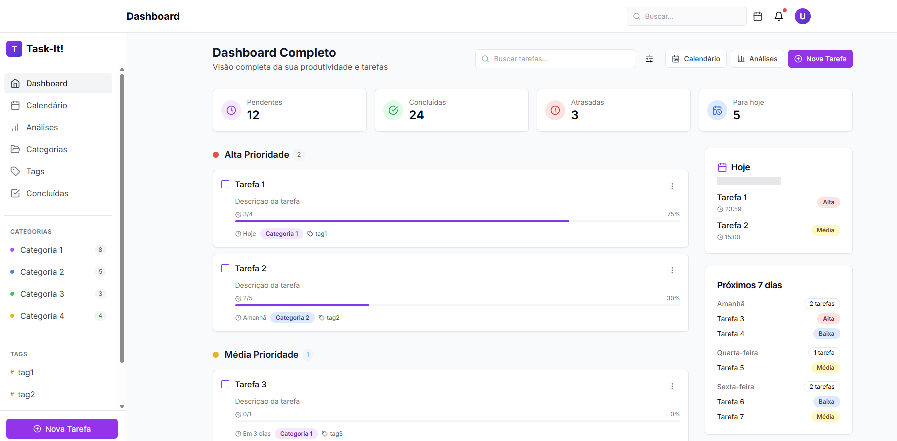
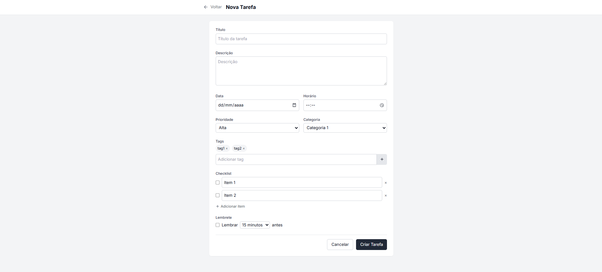

# Task-It! - Gerenciador de Tarefas

> Sistema de gerenciamento de tarefas desenvolvido para estudantes e profissionais que buscam organizar suas atividades diárias de forma simples e eficiente.

## 🎯 Funcionalidades

- **CRUD Completo de Tarefas**: Criar, visualizar, editar e excluir tarefas
-  **Organização por Prioridade**: Tarefas categorizadas em alta, média e baixa prioridade
-  **Interface Responsiva**: Design moderno e adaptável para diferentes dispositivos
-  **Persistência de Dados**: Integração com banco PostgreSQL
-  **Atualizações em Tempo Real**: Interface dinâmica com JavaScript

## Demonstração

**Vídeo de Demonstração:** [Link será inserido após gravação]

### Screenshots

<div align="center">
  
  
</div>

*Dashboard principal com listagem de tarefas organizadas por prioridade e formulário de criação*

## 🚀 Tecnologias Utilizadas

- **Backend:** Node.js + Express.js
- **Template Engine:** EJS
- **Banco de Dados:** PostgreSQL
- **Frontend:** HTML5, CSS3, JavaScript (Vanilla)
- **Arquitetura:** MVC (Model-View-Controller)

## ⚙️ Instalação e Configuração

### Pré-requisitos

- Node.js (versão 14.x ou superior)
- PostgreSQL (versão 12.x ou superior)
- npm ou yarn

### Passos para Executar Localmente

1. **Clone o repositório:**
```bash
git clone [URL_DO_REPOSITORIO]
cd mvc-boilerplate
```

2. **Instale as dependências:**
```bash
npm install
```

3. **Configure o banco de dados:**

Crie um banco PostgreSQL e configure o arquivo `.env`:
```env
DB_HOST=localhost
DB_PORT=5432
DB_USER=seu_usuario
DB_PASSWORD=sua_senha
DB_DATABASE=task_it_db
DB_SSL=false
```

4. **Execute o script de inicialização do banco:**
```bash
npm run init-db
```

5. **Inicie o servidor:**
```bash
npm start
# ou para desenvolvimento:
npm run dev
```

6. **Acesse a aplicação:**
```
http://localhost:3000
```

## 📁 Estrutura do Projeto

```
mvc-boilerplate/
├── assets/                 # Imagens e recursos estáticos
├── config/
│   └── db.js              # Configuração do banco PostgreSQL
├── controllers/           # Controllers MVC
│   └── taskController.js  # Lógica de negócios das tarefas
├── models/               # Models MVC
│   └── Task.js          # Modelo de dados das tarefas
├── routes/              # Rotas da aplicação
│   ├── index.js        # Rotas principais
│   └── tableRoutes.js  # Rotas da API
├── views/              # Templates EJS
│   ├── pages/         # Páginas principais
│   ├── components/    # Componentes reutilizáveis
│   └── layouts/       # Layouts base
├── public/            # Arquivos estáticos (CSS, JS, imagens)
├── scripts/           # Scripts auxiliares
└── documentos/        # Documentação do projeto
```

## Arquitetura MVC

- **Model**: Gerencia dados e lógica de negócios (`models/Task.js`)
- **View**: Interface do usuário com templates EJS (`views/`)
- **Controller**: Processa requisições e coordena Model/View (`controllers/`)

## Scripts Disponíveis

- `npm start`: Inicia o servidor de produção
- `npm run dev`: Inicia com nodemon (desenvolvimento)
- `npm run init-db`: Inicializa o banco de dados
- `npm test`: Executa testes (quando implementados)

## Funcionalidades Implementadas

### Dashboard Principal
- Listagem de tarefas organizadas por prioridade
- Cards coloridos para identificação visual
- Filtros por status (pendente/concluída)
- Interface responsiva

### Gerenciamento de Tarefas
- Formulário de criação com validação
- Edição de tarefas existentes
- Exclusão com confirmação
- Campos: título, descrição, prazo, prioridade

### API RESTful
- `GET /tarefas` - Lista todas as tarefas
- `POST /tarefas` - Cria nova tarefa
- `PUT /tarefas/:id` - Atualiza tarefa
- `DELETE /tarefas/:id` - Remove tarefa

## 🔮 Trabalhos Futuros

- **Autenticação:** Sistema de login/registro
- **Categorias:** Organização por categorias personalizadas
- **Calendário:** Visualização temporal das tarefas
- **Notificações:** Lembretes de vencimento
- **Mobile:** Aplicativo móvel nativo

## 👨‍💻 Desenvolvedor

**Pietro Alkmin** - Estudante de Engenharia de Computação - Inteli

## 📄 Documentação Completa

Para documentação técnica detalhada, consulte: [`documentos/wad.md`](documentos/wad.md)

---

*Projeto desenvolvido como parte do Módulo 2 - Inteli - 2025*

